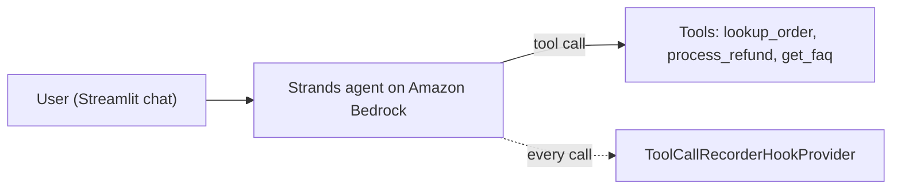

# AI Customer Support Agent

A customer support agent on Amazon Bedrock, built with the Strands Agents SDK. It looks up orders, processes refunds and answers store policy questions through tool use, and an event hook records every tool call so each action can be traced afterwards.

## What it does

- **Order lookup:** returns an order's status, product, amount and date.
- **Refunds:** a tool with typed inputs. It refuses unknown orders, orders already refunded, and orders not yet shipped or delivered.
- **FAQs:** answers return, shipping, warranty, payment and tracking questions from a fixed set.
- **Audit trail:** a hook provider records every tool request and result into the agent's result state.
- **Chat UI:** a Streamlit front end.

## Files

| File | Role |
|---|---|
| `customer_support_agent.py` | The agent: demo data, the three tools, system prompt and model |
| `customer_support_logic.py` | Bridge between the UI and the agent, keeps the chat history |
| `customer_support_app.py` | Streamlit chat interface |
| `tool_call_recorder.py` | Hook provider that records tool requests and results |
| `test_hooks.py` | Runs one order lookup and prints the recorded tool requests |

## Run it locally

1. Python 3.10 or later, and AWS credentials with Amazon Bedrock access to Claude Sonnet 4.5 in your region.
2. `pip install -r requirements.txt`
3. `streamlit run customer_support_app.py`

To check the audit hook on its own: `python test_hooks.py`

## Design decisions

- **Actions go through tools, not text.** A refund is a function call with a fixed set of reasons, so the model decides when to act but not how the action is carried out.
- **Business rules live in the tool.** The refund checks sit in code, so a persuasive customer cannot talk the model into refunding an order twice.
- **Audit from day one.** An agent that can issue refunds needs a record of every call before the first disputed transaction, not after.

## Deployment

During the AWS "Building with Amazon Bedrock" workshop I deployed this agent to Amazon Bedrock AgentCore Runtime, with AgentCore Memory for cross-session context and AgentCore Gateway exposing Lambda-backed tools over IAM-authenticated MCP. That ran in the workshop's temporary AWS account, which no longer exists, so the deployment files are not in this repo. Redeploying it in my own account is on my list.

## Honest boundaries

- Orders, refunds and FAQs use in-memory demo data. No real customers or payments.
- Built in the workshop, then pulled out into this standalone repo.

## Stack

Amazon Bedrock · Strands Agents SDK · Claude Sonnet 4.5 · Streamlit
